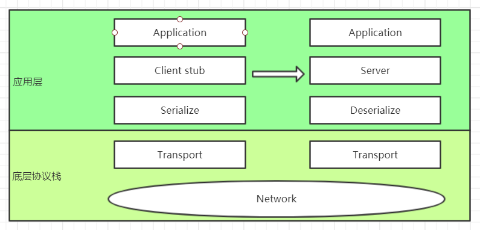

## RpcOnNetty(Ron)
**RPC**( *Remote Procedure Call, 远程过程调用*  ) 一种旨在 **像调用本地方法一样调用远程方法** 来实现通信的方法.
一个好的RPC工具基本要求就是: 
1. 贴近软件开发平台的方法调用机制, 无需用户额外工作, 面向用户(问题)的接口设计
2. 封装底层通信细节, 面向机器的实现 

本文的目的是给出一个**简单RPC工具**案例, 主要聚焦与RPC本身理解. 对于服务治理, 跨语言等高级特性不做关注, 所有设计实现决策一切从简. 由于本案例基于netty框架设计实现, 后续描述内容全部基于Java应用开发平台.


### 1.设计

#### 1.1 API设计

​	server端核心代码如下:

```java
    Ron.getServer().classScan("com.infinite.test").port(8080).serve();
```
``` java
    package com.infinite.test.svc;
    ...

    public interface TestService {
    public void test();
    }

    ....
    @Service
    public class TestServiceImpl implements TestService {...}
```

​	client端核心代码如下:

``` java
	TestService testSvc = Ron.getClient(TestService.class)
```

#### 1.2 实现设计

​	客户端stub使用代理模式实现

​	客户端服务器端数据使用json进行序列化与反序列化, fastjson

​	应用层PDU: 4字节头 + 实际数据

​	传输层通信采用TCP协议, netty



### 2.实现
​	详见源码目录[RON]()